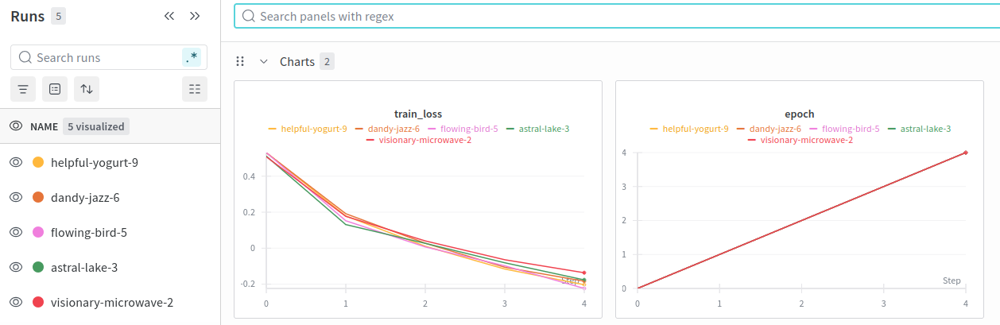
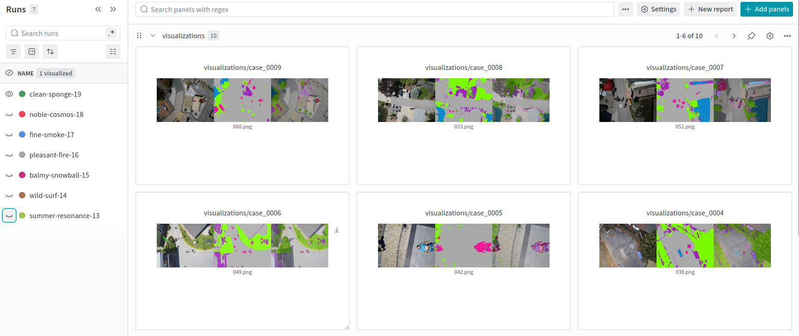

# Containerised nnU-Net Training & Inference

Two GPU Docker images for a drone-imagery segmentation model. One takes raw Kaggle data and produces trained weights. The other takes ordinary photographs and produces colour-overlaid segmentation masks. Each is a single `docker run`.

**Scope.** This is **my part of a five-person group project** for the MLOps course at DTU, January 2026 — not the whole system. The group also built DVC versioning, GitHub Actions CI, BentoML serving, a FastAPI service, GCP deployment and drift monitoring. None of that is mine and none of it is here.

Mine: both Dockerfiles and entrypoints, the custom nnU-Net trainer, the inference scripts, and the two operating guides in `docs/`. The original group repository is [DTU_MLOps_111](https://github.com/ecenazelverdi/DTU_MLOps_111), where the commit history shows the split. That history is not carried over here, because it would republish four other people's commits under my name.

## How the two containers fit together

```
┌──────────────────┐                          ┌──────────────────┐
│ Training         │                          │ Inference        │
│ train.dockerfile │                          │ inference.       │
│                  │                          │ dockerfile       │
│ 1 download data  │      nnUNet_results/     │ 1 RGB → channels │
│ 2 plan+preprocess├────►  model + ckpts  ───►│ 2 predict        │
│ 3 train          │      (shared volume)     │ 3 overlay masks  │
└──────────────────┘                          └──────────────────┘
```

Both containers mount the same `nnUNet_results/` folder, so training output feeds inference directly.

## Three things that made this awkward

nnU-Net is not a library you import. It finds datasets, plans and trainers by convention, through environment variables and its own folder layout. That fights containers in three places.

**Getting my own trainer in.** nnU-Net only looks for trainer classes inside its own installed package, and there is no plugin system. Instead of forking the library, the build copies mine in while the image is being built:

```dockerfile
RUN cp /app/src/dtu_mlops_111/trainers.py \
    $(python3 -c "import nnunetv2, os; print(os.path.dirname(nnunetv2.__file__))")/training/nnUNetTrainer/variants/custom_trainer.py
```

After that, `nnUNetv2_train ... -tr nnUNetTrainer_5epochs_custom` picks it up like any built-in trainer. My subclass caps training at 5 epochs instead of the default 1000, picks CUDA, MPS or CPU automatically, and logs each epoch's loss to both Weights & Biases and a rotating log file.

**Cache folders the container can write to.** matplotlib and torch try to write caches into `HOME`, which the container user may not own — and the run dies halfway through. `HOME`, `MPLCONFIGDIR` and `TORCHINDUCTOR_CACHE_DIR` all point at `/tmp`, and the entrypoint creates them before anything starts.

**Keeping host paths out.** The `nnUNet_raw`, `nnUNet_preprocessed` and `nnUNet_results` variables are set inside the entrypoint and deliberately not read from whatever gets passed in. Otherwise a host `.env` defining them would point the container at folders that do not exist inside it.

## Secrets

Nothing secret goes into an image. Kaggle and W&B keys are passed when the container runs:

```bash
docker run --gpus all --ipc=host --env-file .env ... droneseg-training
```

This is a fix to what I submitted for the course, which had `COPY .env /app/.env` in both Dockerfiles. Every `COPY` becomes a permanent image layer, so anyone holding the image could read the file back — deleting it later does not remove the layer. The run commands in the docs already used `--env-file`, so the `COPY` was doing nothing except leaving credentials behind.

## Results



*Training loss, logged from the custom trainer.*



*Segmentation overlays from the inference container.*

## Running it

[`docs/DOCKER_TRAINING.md`](docs/DOCKER_TRAINING.md) and [`docs/DOCKER_INFERENCE.md`](docs/DOCKER_INFERENCE.md) have the volume mounts and the rest.

One caveat: this repository is the container layer only. The data-download step calls `dtu_mlops_111.data`, which lives in the group repository and is not reproduced here, so the training image will not build into a runnable pipeline from this repository alone. It is here to show the container and trainer design.

## License

MIT — see [LICENSE](LICENSE).
